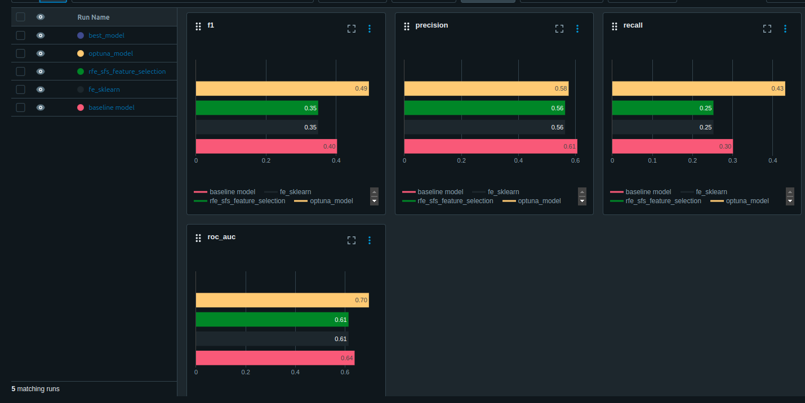

# Описание проекта
Проект посвящен решеню задачи определения банковского кредитного скоринга клиента.

[Ссылка на исходную выборку данных ](https://www.kaggle.com/datasets/kapturovalexander/bank-credit-scoring/data)

Кредитный скоринг — это метод анализа, который банки и другие финансовые организации используют для оценки рисков при выдаче кредитов. Скоринговая оценка основывается на информации о кредитной истории клиента, его финансовом положении и других факторах

# Запуск
Для запуска проекта необходимо выполнить команды:
```
git clone https://github.com/yurchest/IIS_labs.git
cd {директория с проектом}
python3 -m venv .venv_IIS
source .venv_IIS/bin/activate
pip install -r requirements.txt
```

Запуск MlFlow:
```
cd mlflow - переход в папку со bash-скриптом, который запускает Mlflow
sh start_mlflow_server.sh - запуск mlflow
```
После запуска mlflow будет доступен по ссылке: http://localhost:5000/

# Исследование данных

Находится в `./eda/eda.ipynb`. 

В ходе исследования были проведены действия:
* Удалены признаки "pdays","previous", "poutcome", так как не удалось обнаружить их теоретический и физический смысл
* В ходе анализа не было обнаружено аномальных значений признаков, противоречащих их физическому смыслу. Ни одна запись не была удалена.
* Столбцам 'job', 'marital', 'education', 'default', 'housing', 'loan', 'contact', 'month', 'y' был присвоен категориальный тип
* Численныи столбцам ('age', 'balance', 'day', 'duration', 'campaign') был присвоен соответсвующий тип данных, подходящий под конкретный "разброс" значений

В ходе анализа были выявлены следующие закономерности: 
* В сфере менеджмента баланс клиента в среднем больше, а у студента баланс меньше. (график `./eda/graph1.png`)
* Наблюдаем слабую корелляцию признаков (график `./eda/graph2.png`)
* Для женатых клиентов процент отказов в выдаче кредита больше в сравнении с клиентами со статусом "в разводе" и "холост" (график `./eda/graph3.png`)
* Зависимость текущего баланса от возраста (график `./eda/graph4.png`)

Обработанная выборка сохранена в файл `./data/clean_data.pkl`

# Результаты исследования

По результатам исследований были получены следующие метрики качества:



Наилучшие результаты в ходе эксперимента показала последняя модель, в ходе которых были применены следующие настройки:
* добавление новых признаков

```
'num__age', 'num__balance', 'num__day', 'num__duration', 'cat__job',
'cat__marital', 'cat__education', 'cat__default', 'cat__housing','cat__loan','cat__contact', 'cat__month', 'cat__campaign','quantile__balance', 'poly__1', 'poly__age', 'poly__balance','poly__age^2', 'poly__age balance', 'poly__balance^2', 'kbins__age','kbins__balance', 'kbins__day', 'kbins__duration'
```

* отобраны наиболее "важные признаки"

```
'num__age', 'num__day', 'num__duration', 'cat__default', 'cat__housing', 'cat__loan', 'cat__contact', 'cat__month', 'cat__campaign'
```

* С помощью optuna настроены оптимальные параметры для модели:
```json
{
    'n_estimators': 141, 
    'max_depth': 79, 
    'max_features': 0.852566731027194
}
```

**Достигнутые метрики**:
```json
{
    'recall': 0.43089430894308944,
    'precision': 0.5760869565217391,
    'f1': 0.4930232558139535,
    'roc_auc': 0.6961019163763066
 }
```

Лучшая модель была обучена на всей выборке с тэгом Production. Run ID = f42b92f0ac1b49b3b09f833cf02320a7


