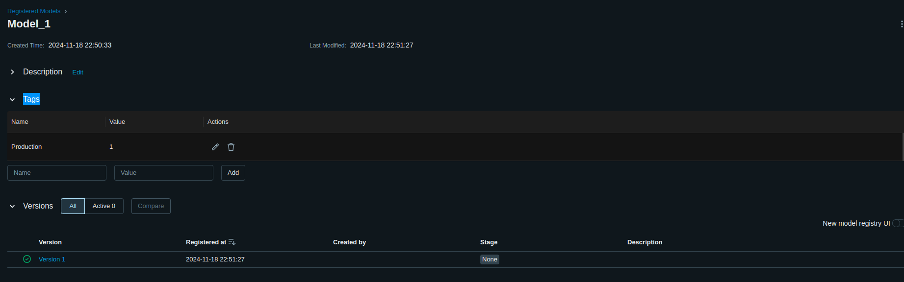

# Описание проекта
Проект посвящен решеню задачи определения банковского кредитного скоринга клиента.

[Ссылка на исходную выборку данных ](https://www.kaggle.com/datasets/kapturovalexander/bank-credit-scoring/data)

Кредитный скоринг — это метод анализа, который банки и другие финансовые организации используют для оценки рисков при выдаче кредитов. Скоринговая оценка основывается на информации о кредитной истории клиента, его финансовом положении и других факторах

Использованные технологии:

* `scikit learn`
* `mlflow`
* `docker`
* `fatapi`
* `prometheus`
* `grafana`

# Запуск
Для запуска проекта необходимо выполнить команды:
```
git clone https://github.com/yurchest/IIS_labs.git
cd {директория с проектом}
python3 -m venv .venv_IIS
source .venv_IIS/bin/activate
pip install -r requirements.txt
```

Запуск MlFlow:
```
cd mlflow - переход в папку со bash-скриптом, который запускает Mlflow
sh start_mlflow_server.sh - запуск mlflow
```
После запуска mlflow будет доступен по ссылке: http://localhost:5000/

# Исследование данных

Находится в `./eda/eda.ipynb`. 

В ходе исследования были проведены действия:
* Удалены признаки "pdays","previous", "poutcome", так как не удалось обнаружить их теоретический и физический смысл
* В ходе анализа не было обнаружено аномальных значений признаков, противоречащих их физическому смыслу. Ни одна запись не была удалена.
* Столбцам 'job', 'marital', 'education', 'default', 'housing', 'loan', 'contact', 'month', 'y' был присвоен категориальный тип
* Численныи столбцам ('age', 'balance', 'day', 'duration', 'campaign') был присвоен соответсвующий тип данных, подходящий под конкретный "разброс" значений

В ходе анализа были выявлены следующие закономерности: 
* В сфере менеджмента баланс клиента в среднем больше, а у студента баланс меньше. (график `./eda/graph1.png`)
* Наблюдаем слабую корелляцию признаков (график `./eda/graph2.png`)
* Для женатых клиентов процент отказов в выдаче кредита больше в сравнении с клиентами со статусом "в разводе" и "холост" (график `./eda/graph3.png`)
* Зависимость текущего баланса от возраста (график `./eda/graph4.png`)

Обработанная выборка сохранена в файл `./data/clean_data.pkl`

# Результаты исследования

По результатам исследований были получены следующие метрики качества:


Наилучшие результаты в ходе эксперимента показала последняя модель, в ходе которых были применены следующие настройки:
* добавление новых признаков

```
'num__age', 'num__balance', 'num__day', 'num__duration', 'cat__job',
'cat__marital', 'cat__education', 'cat__default', 'cat__housing','cat__loan','cat__contact', 'cat__month', 'cat__campaign','quantile__balance', 'poly__1', 'poly__age', 'poly__balance','poly__age^2', 'poly__age balance', 'poly__balance^2', 'kbins__age','kbins__balance', 'kbins__day', 'kbins__duration'
```

* отобраны наиболее "важные признаки"

```
'num__age', 'num__day', 'num__duration', 'cat__default', 'cat__housing', 'cat__loan', 'cat__contact', 'cat__month', 'cat__campaign'
```

* С помощью optuna настроены оптимальные параметры для модели:
```json
{
    'n_estimators': 141, 
    'max_depth': 79, 
    'max_features': 0.852566731027194
}
```

**Достигнутые метрики**:
```json
{
    'recall': 0.43089430894308944,
    'precision': 0.5760869565217391,
    'f1': 0.4930232558139535,
    'roc_auc': 0.6961019163763066
 }
```

Лучшая модель была обучена на всей выборке с тэгом Production. Run ID = f42b92f0ac1b49b3b09f833cf02320a7


# Описание сервиса предсказаний

Итоговая структура проекта:

```
.
├── data
├── eda
│   ├── eda.ipynb
│   ├── graph1.png
│   ├── graph2.png
│   ├── graph3.png
│   └── graph4.png
├── mlflow
│   └── start_mlflow_server.sh
├── README.md
├── requirements.txt
├── research
│   ├── column_names_best_model.txt
│   ├── column_names.txt
│   ├── metrics.png
│   ├── MLmodel
│   ├── registered_models.png
│   ├── research.ipynb
│   ├── rfe_sfs_cols.txt
│   └── rfe_sfs_idx.txt
└── services
    ├── compose.yml
    ├── grafana
    │   ├── Dashboard_1.json
    │   └── grafana.png
    ├── ml_service
    │   ├── api_handler.py
    │   ├── Dockerfile
    │   ├──  .dockerignore
    │   ├── main.py
    │   └── requirements.txt
    ├── models
    │   └── get_model.py
    ├── prometheus
    │   ├── bad_requests.png
    │   ├── buckets.png
    │   ├── prometheus.yml
    │   └── rate_requests.png
    └── requests
        ├── Dockerfile
        └── req.py
```

**Краткое описание сервиса**:
1.  Директория `ml_service`
    * `requirements.txt` - зависимости для сборки образа
    *  `main.py` - FastAPI-приложение, обрабатывающее GET и POST запрос
    * `.dockerignore` - исключения для Docker
    * `api_handler.py` -   класс-обработчик запросов к API `FastAPIHandler`
    * `Dockerfile` - файл для автоматизации сборки образа

2. `models`
    * `get_model.py` - скрипт , который подключается к mlflow, выгружает модель по её run_id и сохраняет ее в файл `model.pkl`

**Команды для создания образа и запуска контейнера**

```console
foo@bar:~$ docker build . --tag estate_model:1
foo@bar:~$ docker run -p 8001:8000 -v $(pwd)/../models:/models estate_model:1
```


**Проверка работоспособность сервиса**

```python
import requests
import random

params = {'cus_id': 12345}
data = {
    "age":          random.randint(1,80),
    "job":          "housemaid",
    "marital":	    "married",
    "education":	"secondary",
    "default":	    "no",
    "balance":	    random.randint(1000,1000000),
    "housing":	    "yes",
    "loan":	        "no",
    "contact":	    "cellular",
    "day":	        random.randint(1,10),
    "month":	    "aug",
    "duration":     699,
    "campaign":     2
    } 

response = requests.post('http://127.0.0.1:8001/api/prediction', params=params, json=data)
print(response.json())
```

# Мониторинг

## 1. Prometheus

Создан файл [prometheus.yml](https://github.com/yurchest/IIS_labs/blob/master/services/prometheus/prometheus.yml)

```yaml
global:
  scrape_interval: 15s
  scrape_timeout: 10s
  # Каждые 15 секунд будет запрашиваться сбор метрик. Если в течение 10 секунд 
  # метрики не удастся собрать, запрос прервется по таймауту.

scrape_configs:
  # Конфигурация сборщика метрик
  - job_name: 'scrapping-main-app'
    # Пусть для метрик и схема подключения
    metrics_path: /metrics
    scheme: http

    static_configs:
    - targets:
      - score-model:8000
      # Адрес сервиса для сбора метрик
```

Этот файл конфигурации используется Prometheus для настройки параметров мониторинга и определения источников сбора метрик. 

- **`global`**: Устанавливает общие параметры, такие как частота опроса (`scrape_interval`) и максимальное время ожидания ответа (`scrape_timeout`).
- **`scrape_configs`**: Определяет отдельные задания для сбора метрик, их параметры и целевые узлы.
- **`job_name`**: Уникальное имя задания.
- **`metrics_path` и `scheme`**: Указывают путь и протокол для доступа к метрикам.
- **`static_configs`**: Указывает список адресов целевых узлов, откуда собираются метрики.


Веб-интерфейс запускается по адресу `127.0.0.1:9090`

## 2. Grafana


**Grafana** — это платформа для визуализации данных и мониторинга систем в реальном времени. Она используется для создания интерактивных дашбордов, которые отображают метрики, собранные из различных источников данных (например, Prometheus, Elasticsearch, InfluxDB). 

### Основные функции:
- **Визуализация данных**: графики, диаграммы, таблицы.
- **Мониторинг и алертинг**: настройка уведомлений при достижении определенных порогов метрик.
- **Подключение к множеству источников**: поддержка множества баз данных и систем мониторинга.
- **Кастомизация дашбордов**: возможность создавать настраиваемые панели под конкретные задачи.

Grafana помогает анализировать данные, отслеживать производительность систем и принимать решения на основе визуализированных метрик.


В дашборд были добавлены следующие графики:

* Распределение по бакетам
* Длительность запросов в секунду
* Средняя нагруженоость поцессора (в секундах)
* 5хх 4хх ответы
* Частота запросов к сервису 

Веб-интерфейс запускается по адресу `127.0.0.1:3000`

# Сборка и запуск проекта

Должны быть собраны образы сервисов `ml_service` и `requests`.

```console
foo@bar:~$ docker compose build
foo@bar:~$ docker compose up
```